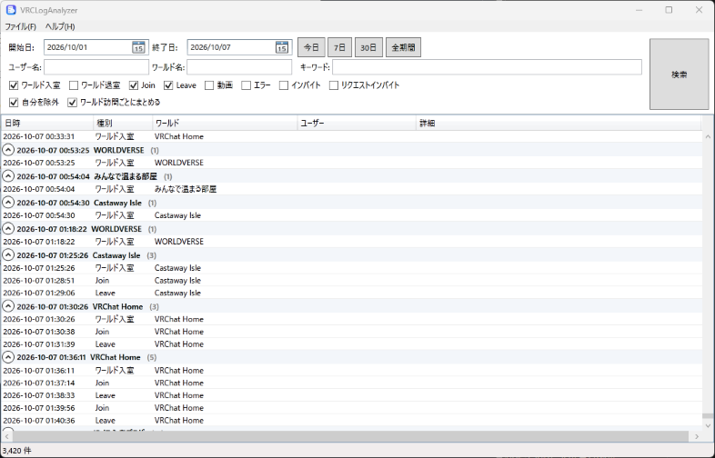

# VRCLogAnalyzer

VRChat のログ（`output_log_*.txt`）を解析し、次の情報をデータベースに記録して条件検索できる Windows アプリ（WPF）です。

- 訪れたワールド（ワールド ID・インスタンス ID 付き）と退室
- 同じインスタンスにいたユーザーの Join / Leave（ユーザー ID 付き）
- 再生された動画 URL
- エラー（Udon の例外など。スタックトレースも保持）
- 自分宛てのインバイト・リクエストインバイト（送り主、招待先のワールド、メッセージ）

本プロジェクトは [sechiro/VRCLogAnalyzer](https://github.com/sechiro/VRCLogAnalyzer)（MIT ライセンス、2021 年）をもとに、現在の VRChat のログ形式への対応と不具合修正を行ったものです。



## 動作環境

- Windows 11（64bit）の最近のビルドを想定しています
- .NET のインストールは不要です（実行に必要なものは exe に含まれています）
- 表示言語: 日本語 / English（既定は Windows の表示言語に合わせます。「ファイル」＞「設定」で切り替えられます）

## 入手方法

GitHub の Releases から `VRCLogAnalyzer-バージョン-win-x64.zip` をダウンロードし、好きなフォルダに展開して `VRCLogAnalyzer.exe` を起動してください。インストールは不要です。

※署名付きアプリではないため、初回起動時に Windows の警告（SmartScreen）が表示されることがあります。配布用の zip は GitHub Actions でこのリポジトリのソースからビルドしています。

## 使い方

1. `VRCLogAnalyzer.exe` を起動すると、VRChat のログフォルダ（`%USERPROFILE%\AppData\LocalLow\VRChat\VRChat`）から自動でログを取り込みます。2 回目以降は増えた分だけを取り込みます。
2. 期間・種別・ユーザー名・ワールド名・キーワードを指定して「検索」します（Enter キーでも検索できます）。
   - ユーザー名・ワールド名・キーワードは部分一致です。`%` や `_` も文字としてそのまま検索します。
   - キーワードはワールド名・ユーザー名・ワールド/ユーザー ID・動画 URL・エラー文を横断して検索します。
   - 「自分を除外」で自分自身の Join / Leave を非表示にできます。
   - 「ワールド訪問ごとにまとめる」でワールドに入った単位でグループ表示します。
   - 動画・エラー・インバイト・リクエストインバイト・ワールド退室は、既定ではチェックが外れています。必要なときにチェックしてください。
3. 右クリックメニューから、名前や詳細のコピー、その値での絞り込み、ワールド・ユーザーのページや動画 URL をブラウザで開く操作ができます（右クリックした行が対象です）。
   - 「ファイル」＞「詳細表示」をオンにすると、画面下部に選択した行の詳細（ワールド・ユーザーの ID、エラーのスタックトレースなど）が表示されます。
4. 「ファイル」＞「表示中の結果を CSV エクスポート」で、現在の検索条件に合う全件を CSV（BOM 付き UTF-8）で出力します。

画面に表示するのは最大 10,000 件です。超える場合は条件を絞り込んでください（CSV エクスポートは全件出力します）。

### 定期取り込み（推奨）

VRChat のログは数日で削除されるため、タスクスケジューラなどで 1 日 1 回以上、次のコマンドを実行してください。ウィンドウを開かずに取り込みだけを行います。

```
VRCLogAnalyzer.exe /analyze
```

| オプション | 説明 |
|---|---|
| `/analyze` | ウィンドウを開かずにログを取り込んで終了する |
| `/db <path>` | データベースファイルを指定する（設定より優先） |
| `/logdir <path>` | VRChat のログフォルダを指定する（設定より優先） |

`-analyze` や `--analyze` の形式も使えます。認識できないオプションがある場合は、何もせずに終了します（終了コード 2）。

### データの保存場所

- 既定: `マイドキュメント\VRCLogAnalyzer\VRCLogAnalyzer.db`（SQLite 3）
- 「ファイル」＞「設定」から、アプリと同じフォルダへの変更や、ログフォルダの変更ができます。設定は `VRCLogAnalyzer.config` に保存されます。
- 動作ログはアプリと同じフォルダの `VRCLogAnalyzer.log` に出力されます。
- 起動時にデータベースを確認し、旧バージョン・古い形式のデータベースだった場合は、**移行前に自動でバックアップ**（`VRCLogAnalyzer.db.backup-v0-日時`）を作ってから移行し、メッセージでお知らせします。より新しいバージョンで作られたデータベースや、認識できないファイルの場合は、壊さないよう開かずに終了します。

### 旧バージョン（sechiro 版 v0.x）からの移行

同じ場所に旧バージョンの `VRCLogAnalyzer.db` がある場合、初回の取り込み時に `UserEncounterHistory` / `WorldVisitHistory` のデータを新しい `LogEvent` テーブルへ自動で移行します。

- 現在ディスクに残っているログの期間は、ログから（ID 付きで）取り込み直すため、それより古いデータだけを移行します。
- 旧テーブルは削除せずに残します。
- 移行前のデータベースは自動でバックアップされます（上記「データの保存場所」参照）。

## 旧バージョンからの主な修正点

| 内容 | 旧バージョンの挙動 |
|---|---|
| .NET 5（サポート終了）→ .NET 10（LTS）へ移行 | 現行環境でビルド・実行できない |
| `Entering Room` / `Joining wrld_...` からワールドを記録 | ワールド ID が常に空 |
| `OnPlayerJoined` / `OnPlayerLeft` からユーザー ID 付きで記録 | Leave を記録しない。ユーザー ID なし |
| 動画 URL・エラーの記録 | 未対応 |
| ワールド情報が無いデータの検索 | `worldinfo[0]` で例外が発生して落ちる |
| 日付条件を `DatePicker.SelectedDate` から作成し、地域設定に依存しない書式で検索（yui0471 氏の修正を参考） | 日本語以外の表示形式だと検索できない |
| 取り込みを差分化し、一意インデックスで重複を排除 | 毎回全ログを 1 行ずつ SELECT して重複確認していたため遅い |
| CSV を RFC 4180 でエスケープし、数式インジェクションを防止 | `"` や改行を含む名前で CSV が壊れる |
| 設定ファイルが無い・壊れていても既定値で起動 | 起動時に例外 |
| ウィンドウのサイズに合わせて一覧が広がり、最小サイズでもボタンが隠れない（TK-R 氏の修正を参考） | リサイズすると一覧や検索ボタンが見切れる |
| VRChat 起動中でもログを読み込める | 起動中に「データ更新」するとメッセージなしで落ちる |

※ VRChat が `[API]` 行にユーザーのプロフィールやワールドの説明文を出力しなくなったため、これらの情報は記録していません。

## 開発

```
dotnet build
dotnet test
dotnet publish src/VRCLogAnalyzer -c Release -p:PublishProfile=win-x64 -o artifacts/publish
```

- 配布用ビルドの設定は `src/VRCLogAnalyzer/Properties/PublishProfiles/win-x64.pubxml`（ランタイム同梱・exe 1 つ）。GitHub Actions も同じ設定でビルドします。
- GitHub Actions（`.github/workflows/build.yml`）: main への push でビルドとテスト、`v` で始まるタグ（例: `v2.0.0`）の push で zip を添付した Release を下書きで作成します。

- `src/VRCLogAnalyzer.Core` … ログ解析・データベース・CSV（UI 非依存、テストあり）
- `src/VRCLogAnalyzer` … WPF アプリ
- `tests/VRCLogAnalyzer.Core.Tests` … xUnit テスト
- ターゲットフレームワークは `Directory.Build.props` で一元管理しています（現在は .NET 10）。

## アプリのコンセプト（旧バージョンから継承）

- ローカル PC のログだけを解析し、VRChat API など外部への通信は行わない
- VRChat の ID・パスワードは扱わない
- 本アプリは VRChat 社とは関係のない有志のアプリです。AS-IS で配布され、開発者は本ソフトウェアの利用によるいかなる損害の責任も負いません。将来の VRChat の仕様変更により利用できなくなる可能性があります。

## 謝辞

- [sechiro](https://github.com/sechiro) 氏 — オリジナルの VRCLogAnalyzer の作者
- [TK-R](https://github.com/TK-R/VRCLogAnalyzer) 氏 — ウィンドウのリサイズ時に一覧や検索ボタンが隠れる問題の修正
- [yui0471](https://github.com/yui0471/VRCLogAnalyzer) 氏 — ロケールにより日付検索ができない問題の修正、.NET 8 対応

各 fork の修正内容は、本バージョンの構成に合わせて再実装しています（詳細は [CHANGELOG.md](CHANGELOG.md)）。

## ライセンス

MIT License（[LICENSE](LICENSE)）。オリジナルの著作権は sechiro 氏に帰属します。
